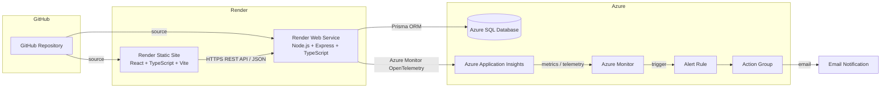

# Snake Game

Ứng dụng web game **Snake Game** được xây dựng bằng **React + TypeScript + Vite** ở phía frontend và **Node.js + Express + TypeScript + Prisma** ở phía backend. Hệ thống được triển khai trên cloud (Render, Azure SQL) và được giám sát bằng **Azure Application Insights**, **Azure Monitor** cùng cơ chế cảnh báo qua email.

---

## Mục lục

1. [Giới thiệu](#1-giới-thiệu)
2. [Mục tiêu hệ thống](#2-mục-tiêu-hệ-thống)
3. [Công nghệ sử dụng](#3-công-nghệ-sử-dụng)
4. [Kiến trúc hệ thống](#4-kiến-trúc-hệ-thống)
5. [Danh sách dịch vụ Cloud](#5-danh-sách-dịch-vụ-cloud)
6. [Chi tiết tích hợp](#6-chi-tiết-tích-hợp)
7. [Deployment](#7-deployment)
8. [Monitoring & Alerting](#8-monitoring--alerting)
9. [Environment Variables](#9-environment-variables)
10. [API Overview](#10-api-overview)
11. [Security Considerations](#11-security-considerations)
12. [Kết quả triển khai](#12-kết-quả-triển-khai)
13. [Repository](#13-repository)

---

## 1. Giới thiệu

**Snake Game** là một ứng dụng web game hoàn chỉnh cho phép:

- **Đăng ký / Đăng nhập** tài khoản người dùng.
- **Chơi game** rắn săn mồi trực tiếp trên trình duyệt.
- **Lưu điểm** của người chơi vào database.
- **Xem lịch sử điểm** của từng tài khoản.
- **Xem bảng xếp hạng** (leaderboard) dựa trên điểm cao nhất.
- **Mở khóa thành tích** (achievements).
- **Quản trị viên (ADMIN)** quản lý người dùng, điểm số, thành tích và xem audit logs qua Admin Dashboard.

Ngoài phần chơi game, dự án còn tập trung vào kiến trúc cloud chuyên nghiệp: tách biệt frontend/backend, kết nối database đám mây, triển khai tự động và giám sát ứng dụng end-to-end.

---

## 2. Mục tiêu hệ thống

- Xây dựng một **web game** hoàn chỉnh với giao diện hiện đại (React + TypeScript).
- Xây dựng **backend API** RESTful (Node.js + Express) phục vụ authentication, điểm số, game session, achievements và quản trị.
- **Lưu dữ liệu trên cloud** bằng Azure SQL Database thông qua Prisma ORM.
- **Triển khai hệ thống trên cloud**: frontend dùng Render Static Site, backend dùng Render Web Service.
- **Monitoring**: thu thập telemetry bằng Azure Application Insights (HTTP, performance, exceptions, dependencies).
- **Alerting**: Azure Monitor phối hợp Action Group gửi cảnh báo qua email khi hệ thống/database gặp sự cố (ví dụ: CPU Azure SQL vượt ngưỡng).

---

## 3. Công nghệ sử dụng

| Thành phần | Công nghệ | Mục đích |
|---|---|---|
| Frontend | React + TypeScript + Vite | Giao diện game, SPA |
| Backend | Node.js + Express + TypeScript | REST API |
| ORM | Prisma | Truy cập database |
| Database | Azure SQL | Lưu trữ dữ liệu |
| Source Control | GitHub | Quản lý source code |
| Frontend Hosting | Render Static Site | Deploy frontend |
| Backend Hosting | Render Web Service | Deploy backend |
| Monitoring | Azure Application Insights | Application telemetry |
| Monitoring | Azure Monitor | Theo dõi và cảnh báo |
| Alerting | Azure Action Group | Gửi email cảnh báo |
| CI | GitHub Actions | Build check backend + frontend |

---

## 4. Kiến trúc hệ thống



### Giải thích từng thành phần

| Thành phần | Vai trò |
|---|---|
| **GitHub** | Lưu trữ toàn bộ source code của frontend và backend. Render lấy source từ repository để build và deploy. |
| **Render Static Site** | Phục vụ bản build tĩnh của frontend (React SPA) cho người dùng. |
| **Render Web Service** | Chạy backend Node.js liên tục (REST API), expose dưới tiền tố `/api`. |
| **Azure SQL Database** | Database đám mây lưu người dùng, điểm số, game session, thành tích, refresh token và audit log. |
| **Prisma ORM** | Lớp truy cập database giữa backend và Azure SQL. |
| **Azure Application Insights** | Thu thập telemetry từ backend (HTTP requests, performance, exceptions, dependencies). |
| **Azure Monitor** | Tổng hợp metric, theo dõi trạng thái hệ thống và cung cấp cơ chế cảnh báo (Alert Rules). |
| **Action Group** | Nhận sự kiện cảnh báo từ Alert Rule và gửi notification tới email người quản trị. |

---

## 5. Danh sách dịch vụ Cloud

| Dịch vụ | Nhà cung cấp | Vai trò |
|---|---|---|
| Render Static Site | Render | Deploy Frontend |
| Render Web Service | Render | Deploy Backend |
| Azure SQL Database | Microsoft Azure | Database lưu trữ dữ liệu ứng dụng |
| Application Insights | Microsoft Azure | Telemetry và Performance Monitoring |
| Azure Monitor | Microsoft Azure | Monitoring và Alert |
| Action Group | Microsoft Azure | Email Notification |

---

## 6. Chi tiết tích hợp

### 6.1 GitHub → Render

- Toàn bộ source code được lưu trên GitHub.
- Render liên kết với repository GitHub: khi có commit mới trên branch `main`, Render tự động kéo source, chạy build và deploy (nếu Auto Deploy được bật).
- Frontend và Backend là hai dịch vụ riêng biệt trên Render (Static Site và Web Service), cùng đọc từ cùng một repository nhưng có cấu hình build/start khác nhau.

### 6.2 Frontend → Backend

- Frontend gọi REST API backend thông qua **HTTPS** với dữ liệu **JSON**.
- Axios client trong `src/services/api.ts` dùng biến `VITE_API_BASE_URL` (giá trị production trỏ tới URL của backend trên Render, kèm tiền tố `/api`).
- Frontend gửi kèm `Authorization: Bearer <accessToken>` cho các request cần đăng nhập và tự động refresh token khi nhận HTTP 401.
- CORS được cấu hình cho phép đúng origin của frontend thông qua biến `FRONTEND_URL` (không dùng `origin: "*"`).

### 6.3 Backend → Azure SQL

- Backend sử dụng **Prisma ORM** để truy vấn và cập nhật dữ liệu trên **Azure SQL Database** (`provider = "sqlserver"` trong `backend/prisma/schema.prisma`).
- Connection string được đọc từ biến môi trường `DATABASE_URL`.
- Các giá trị nhạy cảm (connection string, mật khẩu) được cấu hình **chỉ trên Render Environment Variables**, không commit vào GitHub (chỉ commit `.env.example`).
- Migrations được triển khai lên Azure SQL bằng `npx prisma migrate deploy` (không dùng `migrate dev` với database production).

### 6.4 Backend → Application Insights

- Backend khởi tạo telemetry bằng **Azure Monitor OpenTelemetry** (`@azure/monitor-opentelemetry`) kết hợp instrumentations cho Express và Prisma (xem `backend/src/config/telemetry.ts`).
- Kích hoạt khi biến môi trường `APPLICATIONINSIGHTS_CONNECTION_STRING` được cấu hình trên Render.
- Telemetry thu thập được:
  - **HTTP requests**: request/response đến backend.
  - **Performance**: thời gian phản hồi (response time), throughput.
  - **Failed requests**: request lỗi (4xx/5xx).
  - **Exceptions**: ngoại lệ trong quá trình xử lý.
  - **Dependencies**: các lời gọi tới hệ thống bên ngoài, bao gồm **database** (Prisma instrumentation).

### 6.5 Application Insights → Azure Monitor

- Application Insights đưa telemetry và metric về **Azure Monitor**.
- Azure Monitor tổng hợp dữ liệu để:
  - Theo dõi **metrics** và trạng thái hệ thống.
  - Giám sát **requests**, **failures**, **performance**.
  - Cung cấp dữ liệu cho **Alert Rules**.
- Dữ liệu từ `/api/health` và `/api/health/db` có thể được dùng làm availability probe.

### 6.6 Azure Monitor → Action Group → Email

- **Alert Rule** trong Azure Monitor xác định điều kiện cảnh báo, ví dụ: **CPU của Azure SQL vượt ngưỡng cao (lớn hơn ~80%)** hoặc tỷ lệ request lỗi vượt ngưỡng.
- Khi điều kiện được thỏa mãn, Alert Rule kích hoạt và gửi sự kiện tới **Action Group**.
- **Action Group** thực hiện hành động notification, gửi **email cảnh báo** tới người quản trị để xử lý kịp thời.

---

## 7. Deployment

Quy trình triển khai:

```
Developer → Git → GitHub → Render → Build → Deploy → Production
```

### Frontend (Render Static Site)

- Build: `npm install` → `npm run build` (TypeScript compile + Vite build ra thư mục `dist/`).
- Render phục vụ bản build tĩnh dưới dạng Static Site.

### Backend (Render Web Service)

- Install & build: `npm install` (tự động chạy `prisma generate`) → `npm run build` (TypeScript compile ra `dist/`).
- Start: `npm start` → `node dist/server.js`, server bind `0.0.0.0` và lắng nghe trên cổng từ biến `PORT`/`APP_PORT`.

### Tự động deploy

- Render lấy source trực tiếp từ GitHub repository.
- Khi có commit mới trên branch `main`, Render tự động build và deploy lại (nếu **Auto Deploy** được bật).
- `Environment Variables` được cấu hình trực tiếp trên Render (không cần file `.env` trong production).
- **Secrets không bao giờ được commit vào GitHub**; chỉ template `.env.example` được lưu trong repo.
- GitHub Actions (`.github/workflows/ci.yml`) chạy CI trên mỗi push/PR: cài dependencies, `prisma generate`, build backend và frontend để đảm bảo mã nguồn luôn build được.

---

## 8. Monitoring & Alerting

### Application Insights

- **Overview**: tổng quan về requests, failures, availability, performance.
- **Live Metrics**: theo dõi metric theo thời gian thực.
- **Performance**: thời gian phản hồi của các endpoint.
- **Requests**: số lượng request và phân bố theo endpoint.
- **Failed Requests**: các request thất bại (4xx/5xx).
- **Exceptions**: ngoại lệ trong backend.
- **Dependencies**: lời gọi tới Azure SQL (Prisma instrumentation) và các dependency khác.

### Azure Monitor

- **Metrics**: tổng hợp metric từ Application Insights (CPU, memory, requests, ...).
- **Alert Rules**: định nghĩa điều kiện cảnh báo.
- **SQL CPU Alert**: Alert Rule giám sát CPU của Azure SQL, cảnh báo khi vượt ngưỡng cao (~80%).
- **Monitoring**: theo dõi trạng thái tổng thể hệ thống/database.

### Action Group

- Nhận sự kiện từ Alert Rule khi có cảnh báo.
- Gửi **email notification** tới địa chỉ email người quản trị.

---

## 9. Environment Variables

> Actual values are configured securely in Render Environment Variables and are not committed to GitHub.

### Frontend

| Biến | Mô tả |
|---|---|
| `VITE_API_BASE_URL` | Base URL của backend API (production trỏ tới URL backend trên Render, kèm `/api`). |

### Backend

| Biến | Mô tả |
|---|---|
| `DATABASE_URL` | Connection string tới Azure SQL (Prisma). |
| `SHADOW_DATABASE_URL` | Connection string shadow database (chỉ dùng khi chạy `prisma migrate dev` cục bộ). |
| `JWT_SECRET` | Secret ký access token. |
| `JWT_REFRESH_SECRET` | Secret ký refresh token. |
| `JWT_EXPIRES_IN` | Thời gian sống của access token (mặc định `15m`). |
| `JWT_REFRESH_EXPIRES_IN` | Thời gian sống của refresh token (mặc định `7d`). |
| `FRONTEND_URL` | Origin của frontend (dùng cho CORS). |
| `PORT` / `APP_PORT` | Cổng lắng nghe của backend. |
| `NODE_ENV` | Môi trường chạy (`development` / `production`). |
| `APPLICATIONINSIGHTS_CONNECTION_STRING` | Connection string của Azure Application Insights (kích hoạt telemetry). |

---

## 10. API Overview

Tất cả endpoint nằm dưới tiền tố `/api`. Xác thực dùng JWT (Bearer token), refresh token được lưu trong HttpOnly cookie.

### Health & Meta

| Method | Path | Auth | Mô tả |
|---|---|---|---|
| GET | `/api/health` | Public | Kiểm tra trạng thái backend. |
| GET | `/api/health/db` | Public | Kiểm tra kết nối database (HTTP 503 nếu database không truy cập được). |
| GET | `/api/version` | Public | Phiên bản ứng dụng. |
| GET | `/api/info` | Public | Thông tin chung về ứng dụng. |

### Authentication

| Method | Path | Auth | Mô tả |
|---|---|---|---|
| POST | `/api/auth/register` | Public (rate limited) | Đăng ký tài khoản. |
| POST | `/api/auth/login` | Public (rate limited) | Đăng nhập, cấp access token và refresh token. |
| POST | `/api/auth/refresh` | Public | Refresh access token bằng refresh token (body hoặc cookie). |
| POST | `/api/auth/logout` | Public | Đăng xuất, thu hồi refresh token. |
| GET | `/api/auth/me` | JWT | Lấy thông tin người dùng hiện tại. |

### Scores

| Method | Path | Auth | Mô tả |
|---|---|---|---|
| GET | `/api/scores/top` | Public | Bảng xếp hạng điểm cao nhất (leaderboard). |
| GET | `/api/scores/history` | JWT | Lịch sử điểm của người dùng hiện tại (phân trang `page`/`limit`). |
| GET | `/api/scores/:id` | JWT | Chi tiết một điểm số (chủ sở hữu hoặc ADMIN). |
| POST | `/api/scores` | Optional | Lưu điểm (userId lấy từ JWT nếu đăng nhập, ngược lại dùng `playerName` khách). |
| DELETE | `/api/scores/:id` | ADMIN | Xóa điểm số. |

### Game Sessions

| Method | Path | Auth | Mô tả |
|---|---|---|---|
| POST | `/api/game/sessions` | JWT | Tạo game session mới. |
| GET | `/api/game/sessions` | JWT | Danh sách game session của người dùng hiện tại. |
| POST | `/api/game/sessions/:id/end` | JWT | Kết thúc game session. |

### Achievements

| Method | Path | Auth | Mô tả |
|---|---|---|---|
| GET | `/api/achievements` | Public | Danh sách thành tích. |
| GET | `/api/achievements/me` | JWT | Thành tích đã mở khóa của người dùng hiện tại. |

### Admin

| Method | Path | Auth | Mô tả |
|---|---|---|---|
| GET | `/api/admin/users` | ADMIN | Danh sách người dùng. |
| PATCH | `/api/admin/users/:id` | ADMIN | Cập nhật người dùng (kích hoạt/vô hiệu hóa). |
| GET | `/api/admin/scores` | ADMIN | Danh sách toàn bộ điểm số. |
| GET | `/api/admin/achievements` | ADMIN | Danh sách toàn bộ thành tích. |
| GET | `/api/admin/audit-logs` | ADMIN | Nhật ký audit (các thao tác quản trị). |

---

## 11. Security Considerations

- **HTTPS**: toàn bộ giao tiếp frontend ↔ backend sử dụng HTTPS.
- **JWT authentication**: access token ngắn hạn + refresh token dài hạn được lưu trong HttpOnly cookie; refresh token được xoay vòng (rotation) mỗi lần refresh.
- **Password hashing**: mật khẩu được hash bằng `bcryptjs`, không bao giờ lưu plaintext.
- **CORS**: chỉ cho phép đúng origin của frontend (`FRONTEND_URL` + các origin dev), bật `credentials`, không dùng `origin: "*"`.
- **Environment Variables**: mọi cấu hình nhạy cảm được đọc từ Environment Variables trên Render.
- **Không commit secrets**: `.env`, connection string, JWT secret không bao giờ được commit vào GitHub (đã có trong `.gitignore`).
- **Database credentials**: quản lý qua `DATABASE_URL`/`SHADOW_DATABASE_URL` trong Environment Variables, không xuất hiện trong source code.
- **Azure SQL firewall / network**: truy cập Azure SQL được kiểm soát qua firewall rules của Azure — chỉ các IP/dịch vụ được phép (bao gồm Render Web Service) mới kết nối được.

---

## 12. Kết quả triển khai

- **Frontend đã deploy** trên Render Static Site — production `VITE_API_BASE_URL` trỏ tới backend Render (được ghi nhận trong `.env.example`).
- **Backend đã deploy** trên Render Web Service — REST API expose dưới `/api`, CORS trỏ tới frontend production qua `FRONTEND_URL`.
- **Azure SQL hoạt động** — backend kết nối qua Prisma ORM (`provider = "sqlserver"`), migrations được áp dụng bằng `prisma migrate deploy`.
- **Application Insights** — code telemetry sử dụng Azure Monitor OpenTelemetry (Express + Prisma instrumentation) đã được tích hợp trong backend; telemetry được kích hoạt khi `APPLICATIONINSIGHTS_CONNECTION_STRING` được cấu hình trên Render.
- **Azure Monitor hoạt động** — tiếp nhận metric/telemetry từ Application Insights để theo dõi requests, failures, performance.
- **Alert Rule được cấu hình** — ví dụ: cảnh báo khi CPU của Azure SQL vượt ngưỡng cao (~80%).
- **Action Group gửi email** — nhận sự kiện từ Alert Rule và gửi cảnh báo qua email tới người quản trị.

> Lưu ý: cấu hình Alert Rule và Action Group được thực hiện trên Azure Portal, nằm ngoài source code. Các trạng thái "đã hoạt động" ở trên dựa trên cấu hình trong repository và môi trường triển khai hiện tại.

---

## 13. Repository

- Repository: https://github.com/nguyenquy205cm-byte/SnakeGame---JavaScript-main
- Branch chính: `main`
